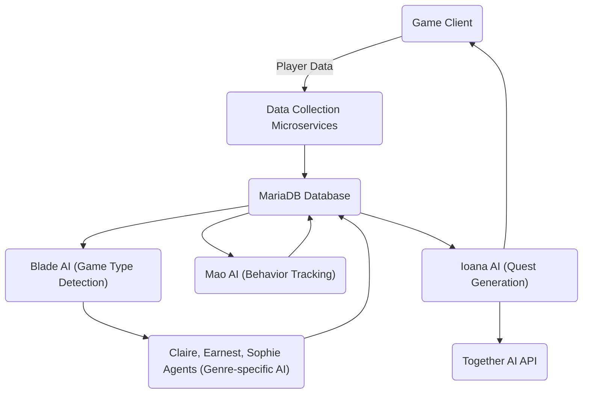

# Player Breeding System

## Overview
The Player Breeding System is an advanced hybrid AI-driven platform designed to dynamically analyze player behavior, performance, and financial data to optimize player progression and engagement in online games. It leverages a combination of Rust-based core logic and Python microservices to collect data, tune game probabilities, and generate personalized quests using state-of-the-art AI models, including integration with the Together AI API.

## Features
- Real-time player data collection from game clients (stats, achievements, financial, behavior).
- AI agents specialized by game genre to dynamically adjust drop rates, loot quality, and win probabilities.
- Personalized quest generation using DeepSeek-R1 AI model.
- Behavior tracking and clustering for adaptive quest and game design.
- Modular architecture with Rust core and Python microservices.
- MariaDB backend for centralized data storage.
- Configurable via TOML files.
- Dockerized deployment for easy setup and scalability.

## Architecture Overview
- **Rust Core**: Implements game type detection (Blade AI), data orchestration, and AI agent logic for probability tuning.
- **Python Microservices**: Handle data ingestion, AI model integration, quest generation (Ioana AI), behavior analysis (Mao AI), and communication with Together AI API.
- **MariaDB**: Central database storing player stats, achievements, financial data, and behavior logs.
- **Together AI API**: Provides advanced AI capabilities for quest generation and dynamic adjustments.

## Technology Stack
- Programming Languages: Rust, Python
- Database: MariaDB (accessed asynchronously via asyncmy)
- Web Framework: FastAPI (Python microservices)
- AI/ML Libraries: scikit-learn, PyTorch, LangChain, OpenAI API
- Configuration: TOML
- Containerization: Docker, Docker Compose

## Setup and Installation

### Prerequisites
- Docker and Docker Compose installed
- Rust toolchain installed (for building Rust components)
- Python 3.8+ installed (for running microservices locally)
- MariaDB server (can be run via Docker)

### Installation Steps

1. Clone the repository:
   ```bash
   git clone <repository-url>
   cd Player-Breeding-System
   ```

2. Configure the database connection and AI parameters in `src/config.toml`.

3. Install Python dependencies:
   ```bash
   pip install -r requirements.txt
   ```

4. Initialize the database schema using migration scripts in the `migrations/` directory.

5. Build Rust components:
   ```bash
   cargo build --release
   ```

6. Run the system using Docker Compose:
   ```bash
   docker-compose up --build
   ```

Alternatively, run Python microservices and Rust binaries separately for development.

## Configuration
All configurable parameters are located in `src/config.toml`, including:
- Database connection URL
- AI agent thresholds and tuning parameters
- Together AI API key and model settings
- Behavior tracking and quest generation options

## AI Agents Description
- **Blade AI**: Detects game type and routes data to appropriate genre agents.
- **Claire, Earnest, Sophie Agents**: Genre-specific agents that adjust game probabilities based on player data.
- **Mao AI**: Tracks player behavior and clusters data for adaptive quest design.
- **Ioana AI**: Generates personalized quests using the DeepSeek-R1 model.
- **Together AI Integration**: Provides advanced AI completions and model inference.

## Roadmap and Next Steps
Refer to [NEXT_STEPS.md](NEXT_STEPS.md) for detailed plans including:
- Data collection API development
- Inter-agent communication protocols
- AI model training and evaluation
- Testing, monitoring, and logging enhancements
- Ethical compliance and privacy considerations
- Documentation and deployment improvements

## Contributing
Contributions are welcome! Please fork the repository and submit pull requests for bug fixes, features, or improvements. Ensure code quality and include tests where applicable.

## License
See the [LICENSE](LICENSE) file for license information.

## References
- Configuration examples and API references are available in the `references/` directory.
- Logs are stored in `player_breeding_system_rCURRENT.log` and rotated logs in `player_breeding_system_r00000.log`.
- Migration scripts for database schema are in the `migrations/` folder.

---

This README provides a comprehensive overview and guide to the Player Breeding System project for developers and contributors.

## Workflow Visualization



## Developer 👨‍💻

Developed by [Blackbeard](https://blackbeard.one) | [Ten Titanics](https://tentitanics.com) | [GitHub](https://github.com/blackbeardONE)

© 2023-2024 Blackbeard. All rights reserved.